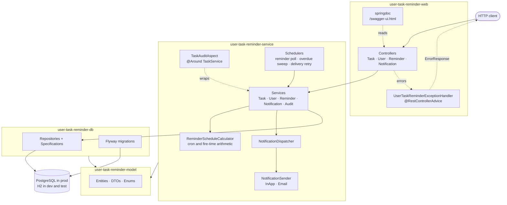
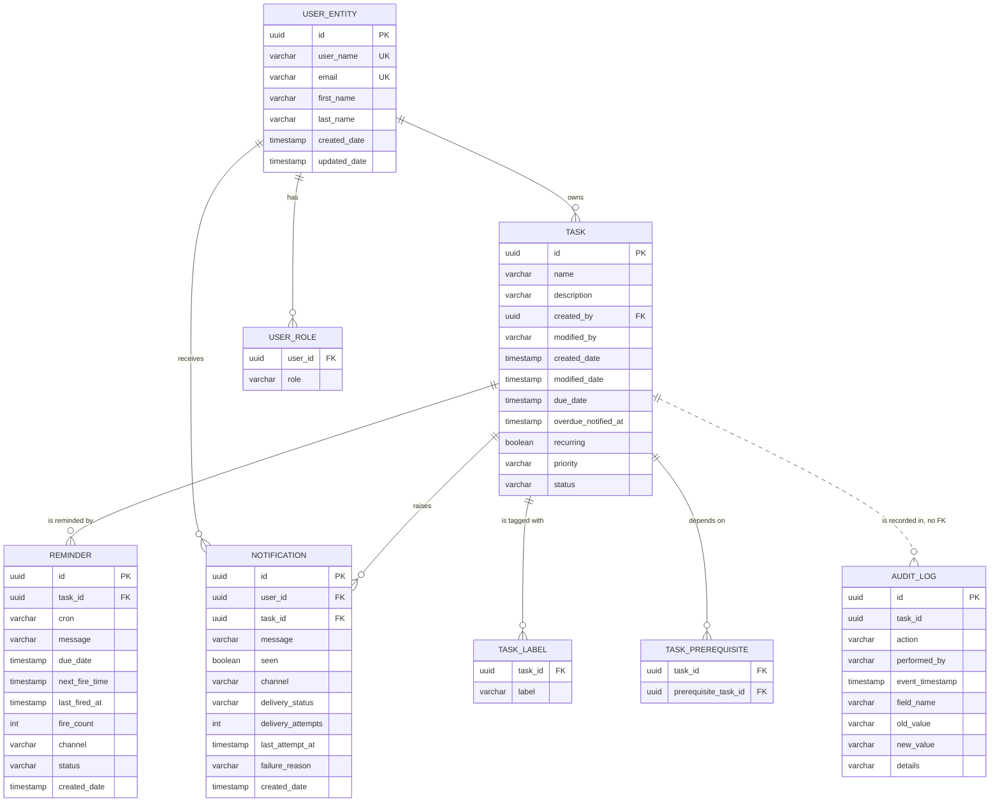
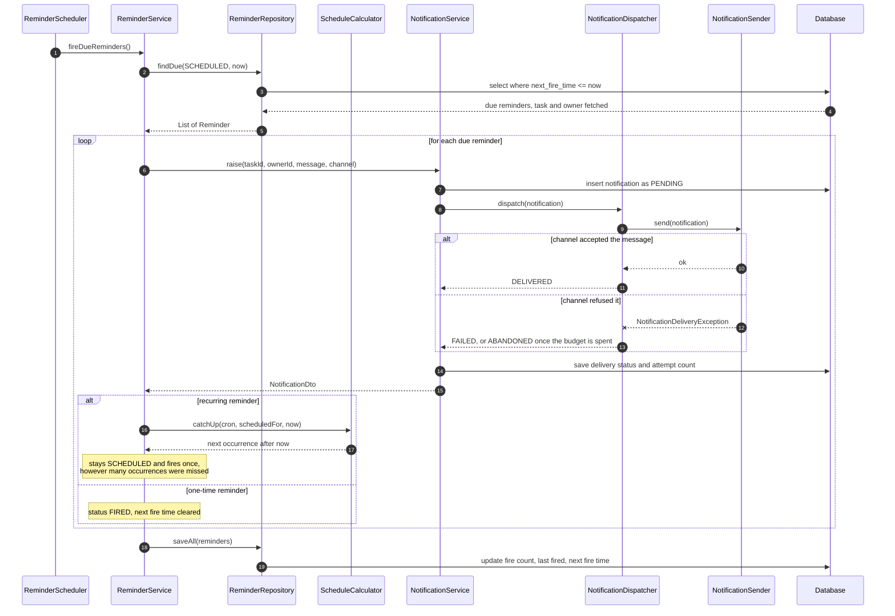

# User Task Reminder

[](https://github.com/PraveenVilayil/user-task-reminder/actions/workflows/ci.yml)
[](https://adoptium.net/)
[](https://spring.io/projects/spring-boot)
[](LICENSE)

A multi-module Spring Boot REST API for tasks and the reminders attached to
them. Schedule a one-time or recurring reminder against a task; when it fires,
the service creates a notification and dispatches it over a delivery channel.
Every change to a task is recorded in an audit trail without any service having
to ask for it.

Built as a learning project by two contributors, with the effort concentrated on
the parts that are easy to get wrong: cron arithmetic that survives downtime,
delivery that records its own failures, and an audit trail that cannot be
forgotten.

> **Scope.** This is a backend API. There is no web or mobile client, and no
> authentication layer yet. See the [Roadmap](#roadmap) for what is planned and
> deliberately not claimed here.

---

## Table of contents

- [Features](#features)
- [Architecture](#architecture)
- [Domain model](#domain-model)
- [How a reminder becomes a notification](#how-a-reminder-becomes-a-notification)
- [Modules](#modules)
- [Tech stack](#tech-stack)
- [Getting started](#getting-started)
- [API reference](#api-reference)
- [Error responses](#error-responses)
- [Configuration](#configuration)
- [Testing](#testing)
- [Project structure](#project-structure)
- [Screenshots](#screenshots)
- [Roadmap](#roadmap)
- [Contributors](#contributors)
- [Contributing](#contributing)
- [License](#license)

---

## Features

### Reminder scheduling

- **One-time reminders** fire once at a given instant, then close.
- **Recurring reminders** follow a Spring six-field cron expression. The next
  fire time is always strictly after the current one, so an occurrence can never
  fire twice.
- **Cron expressions are validated at creation time**, so a typo is a `400` on
  the request rather than a scheduler failure hours later.
- **Missed reminders are recovered at startup.** A daily reminder that slept
  through five days of downtime fires once and is rescheduled to its next future
  occurrence, instead of replaying five notifications at once.
- **Cancel without deleting** — a cancelled reminder stops firing but keeps its
  fire history.

### Tasks

- Full CRUD with partial (`PATCH`) updates: only the fields present in the body
  are applied.
- **Search** with pagination, sorting and filtering by status, priority,
  assignee, label, due-date range and overdue state, plus free-text matching
  across name and description.
- **Task dependencies** — a task can declare prerequisite tasks. Completing it
  while a prerequisite is still open is refused with a `409`, and a dependency
  that would close a cycle, directly or transitively, is rejected.
- **Overdue detection** — a scheduled sweep flags tasks past their due date and
  raises one notification each. Moving the due date re-arms it.

### Notifications

- **Pluggable channel senders.** `NotificationSender` is a strategy interface,
  one implementation per channel, discovered by Spring and indexed by channel.
- **In-app (`WEB`)** works out of the box and needs nothing external.
- **Email (`EMAIL`)** over Spring Mail, registered only when explicitly enabled,
  so the default profile, the tests and CI never need an SMTP server.
- **Delivery is tracked, not assumed.** Every notification carries a delivery
  status, an attempt count, the last attempt time and the failure reason. A
  scheduled sweep retries failures until the attempt budget is spent, then
  abandons them so the retry loop terminates.

### Audit logging

- Task creates, updates, status changes and deletes are recorded automatically
  by an AOP aspect. No service calls the audit service, so a new code path
  cannot forget to audit itself.
- Each entry records **who, what, when, and old → new values**. A status
  transition gets its own entry so it can be queried on its own; an update that
  changes nothing writes nothing.
- The trail is deliberately not foreign-keyed to the task, so history outlives
  the row it describes.
- Queryable per task: `GET /task/{id}/audit`.

### Foundations

- **Bean Validation** on every DTO, with create and update groups so one class
  backs both a full create and a sparse patch.
- **One error shape everywhere**, keyed by a stable `UTR-xxx` code.
- **Flyway migrations** own the schema. Hibernate never generates DDL.
- **OpenAPI 3** document and Swagger UI generated from the annotated controllers.
- **Two runtime profiles**: `dev` on in-memory H2 with zero setup, `prod` on
  PostgreSQL.

---

## Architecture

The reactor is a straight dependency chain: the web module knows about services,
services know about repositories, repositories know about entities, and nothing
points back up.



The scheduler is a **poll loop over an indexed `next_fire_time` column**, not one
in-memory timer per reminder. Reminders live in the database, so they survive a
restart, can be created from any instance, and a missed fire time is picked up on
the next sweep rather than lost.

---

## Domain model



`AUDIT_LOG.task_id` is intentionally not a foreign key: deleting a task must not
erase the record that it was deleted.

---

## How a reminder becomes a notification



---

## Modules

| Module | Responsibility | Key contents |
| --- | --- | --- |
| **`user-task-reminder-model`** | The vocabulary of the domain. No Spring, no persistence logic, no behaviour beyond the entity mapping itself. Every other module depends on it. | JPA entities (`User`, `Task`, `Reminder`, `Notification`, `AuditLog`), request and response DTOs, enums (`Status`, `Priority`, `Channel`, `ReminderStatus`, `DeliveryStatus`, `AuditAction`), Bean Validation groups |
| **`user-task-reminder-db`** | Persistence. Owns how data is stored and queried, including the schema itself. | Spring Data repositories with entity graphs, `TaskSpecifications` for filtered search, Flyway migrations under `db/migration` |
| **`user-task-reminder-service`** | Business rules. Everything that decides *what should happen* lives here, including the scheduling arithmetic and the exception catalogue. | Service interfaces and implementations, `ReminderScheduleCalculator`, `NotificationDispatcher` and senders, `TaskAuditAspect`, the schedulers, `ErrorCode` and the exception handler |
| **`user-task-reminder-web`** | HTTP. Maps requests onto services, and nothing more. | Controllers with OpenAPI annotations, `ApiConstants`, `OpenApiConfig`, `JpaConfig`, `application.yaml`, the Spring Boot entry point |

The `@RestControllerAdvice` lives in the service module beside the `ErrorCode`
catalogue it translates, which is the arrangement the project already used before
this work.

---

## Tech stack

| Layer | Technology | Version |
| --- | --- | --- |
| Language | Java | 21 |
| Framework | Spring Boot | 3.4.4 |
| Web | Spring Web MVC | managed by Boot |
| Persistence | Spring Data JPA / Hibernate | managed by Boot |
| Database (prod) | PostgreSQL | 16 |
| Database (dev and test) | H2 | managed by Boot |
| Migrations | Flyway | managed by Boot |
| Scheduling | Spring `@Scheduled` + `CronExpression` | managed by Boot |
| Validation | Jakarta Bean Validation / Hibernate Validator | managed by Boot |
| Mapping | ModelMapper | 3.2.2 |
| API docs | springdoc-openapi | 2.8.6 |
| AOP | Spring AOP / AspectJ weaver | managed by Boot |
| Mail | Spring Mail (Jakarta Mail) | managed by Boot |
| Boilerplate | Lombok | managed by Boot |
| Testing | JUnit 5, Mockito, AssertJ, Spring Test | managed by Boot |
| Build | Maven (wrapper included) | 3.9.9 |

---

## Getting started

### Prerequisites

- **JDK 21** — the reactor sets `java.version` to `21`. Nothing else is needed
  for the default profile.
- **Maven is not required**; use the bundled `./mvnw` wrapper.
- **Docker and Docker Compose** only if you want the PostgreSQL and MailHog
  stack.

### Option 1 — run locally with the wrapper (no Docker, no database)

The default `dev` profile uses in-memory H2, so a fresh clone runs with no
configuration at all.

```bash
git clone https://github.com/PraveenVilayil/user-task-reminder.git
cd user-task-reminder

# Build every module and run the full test suite.
./mvnw clean verify

# Package the runnable jar and start it on http://localhost:8080
./mvnw -DskipTests package
java -jar user-task-reminder-web/target/user-task-reminder.jar
```

On Windows, use `mvnw.cmd` in place of `./mvnw`.

For an iterative loop with restart-on-change, install the modules once and then
use the Spring Boot plugin:

```bash
./mvnw -DskipTests install
./mvnw -pl user-task-reminder-web spring-boot:run
```

| What | Where |
| --- | --- |
| Swagger UI | <http://localhost:8080/swagger-ui.html> |
| OpenAPI document | <http://localhost:8080/v3/api-docs> |
| Health | <http://localhost:8080/actuator/health> |
| H2 console (`dev` only) | <http://localhost:8080/h2-console> — JDBC URL `jdbc:h2:mem:usertaskreminder`, user `sa`, empty password |

Data in the `dev` profile is in memory and is lost on restart.

### Option 2 — Docker Compose (PostgreSQL + MailHog)

```bash
cp .env.example .env
# Set POSTGRES_PASSWORD in .env; the stack refuses to start without it.

docker compose up --build
```

| What | Where |
| --- | --- |
| API | <http://localhost:8080> |
| Swagger UI | <http://localhost:8080/swagger-ui.html> |
| MailHog inbox | <http://localhost:8025> |
| PostgreSQL | `localhost:5432` |

The app waits for the PostgreSQL healthcheck before starting, so Flyway never
races the database. `docker compose down` stops the stack and keeps the data;
`docker compose down -v` discards it.

> The Dockerfile and compose file have not been executed by the author — see
> [Verification status](#verification-status).

### A five-minute tour

```bash
BASE=http://localhost:8080/taskManagement/api/v1

# 1. Create a user.
USER_ID=$(curl -sX POST "$BASE/user" -H 'Content-Type: application/json' \
  -d '{"userName":"vivek","email":"vivek@example.com","roles":["ROLE_USER"]}' \
  | sed -E 's/.*"id":"([^"]+)".*/\1/')

# 2. Create a task they own.
TASK_ID=$(curl -sX POST "$BASE/task" -H 'Content-Type: application/json' \
  -d "{\"name\":\"Ship the release notes\",\"createdById\":\"$USER_ID\",\"priority\":\"HIGH\",\"labels\":[\"release\"]}" \
  | sed -E 's/.*"id":"([^"]+)".*/\1/')

# 3. Attach a recurring reminder: 09:00 every weekday.
curl -sX POST "$BASE/reminder" -H 'Content-Type: application/json' \
  -d "{\"taskId\":\"$TASK_ID\",\"cron\":\"0 0 9 * * MON-FRI\",\"message\":\"Release check-in\"}"

# 4. Complete the task, then read its audit trail.
curl -sX PATCH "$BASE/task/$TASK_ID" -H 'Content-Type: application/json' \
  -d '{"status":"COMPLETED","modifiedBy":"vivek"}'
curl -s "$BASE/task/$TASK_ID/audit"

# 5. Search.
curl -s "$BASE/task/search?q=release&status=COMPLETED&sort=dueDate,asc"
```

---

## API reference

Every path below is prefixed with `/taskManagement/api/v1`.

### Tasks

| Method | Path | Description | Success |
| --- | --- | --- | --- |
| `POST` | `/task` | Create a task | `201` |
| `GET` | `/task` | List every task | `200` |
| `GET` | `/task/search` | Paged, sorted, filtered search | `200` |
| `GET` | `/task/{id}` | Fetch one task | `200` |
| `PATCH` | `/task/{id}` | Partial update | `200` |
| `DELETE` | `/task/{id}` | Delete a task | `204` |
| `GET` | `/task/{id}/audit` | Change history, newest first | `200` |
| `GET` | `/task/{id}/reminder` | Reminders attached to the task | `200` |

**`POST /task`**

```json
{
  "name": "Ship the release notes",
  "description": "Summarise what changed in v1",
  "createdById": "8b1f0f2c-6f4a-4a1e-9a0f-2b7f4c8d9e10",
  "dueDate": "2026-09-01T17:00:00",
  "priority": "HIGH",
  "status": "PENDING",
  "labels": ["release", "docs"],
  "prerequisiteIds": []
}
```

`201 Created`

```json
{
  "id": "3f2a1c88-1a3f-4a2e-b0d1-9f2c4e6a8b01",
  "name": "Ship the release notes",
  "description": "Summarise what changed in v1",
  "createdById": "8b1f0f2c-6f4a-4a1e-9a0f-2b7f4c8d9e10",
  "createdBy": {
    "id": "8b1f0f2c-6f4a-4a1e-9a0f-2b7f4c8d9e10",
    "userName": "vivek",
    "email": "vivek@example.com",
    "roles": ["ROLE_USER"]
  },
  "createdDate": "2026-08-29T10:15:30",
  "dueDate": "2026-09-01T17:00:00",
  "priority": "HIGH",
  "status": "PENDING",
  "labels": ["release", "docs"],
  "overdue": false
}
```

Only `name` and `createdById` are required; `status` defaults to `PENDING`.

**`GET /task/search`** — every parameter is optional.

| Parameter | Type | Description |
| --- | --- | --- |
| `q` | string | Case-insensitive match across name and description |
| `status` | `PENDING` \| `IN_PROGRESS` \| `COMPLETED` | Exact status |
| `priority` | `LOW` \| `MEDIUM` \| `HIGH` \| `CRITICAL` | Exact priority |
| `assigneeId` | UUID | Owner |
| `label` | string | Tasks carrying this label |
| `overdue` | boolean | `true` for past-due and not completed; `false` inverts it |
| `dueFrom` | ISO date-time | Due at or after |
| `dueTo` | ISO date-time | Due at or before |
| `page` | int | Zero-based page index, default `0` |
| `size` | int | Page size, default `20`, capped at `200` |
| `sort` | string | `field,direction` — default `createdDate,desc`. Sortable fields: `name`, `createdDate`, `modifiedDate`, `dueDate`, `priority`, `status` |

`200 OK`

```json
{
  "content": [
    { "id": "3f2a1c88-1a3f-4a2e-b0d1-9f2c4e6a8b01", "name": "Ship the release notes", "status": "PENDING" }
  ],
  "page": 0,
  "size": 20,
  "totalElements": 1,
  "totalPages": 1,
  "first": true,
  "last": true
}
```

**`PATCH /task/{id}`** — only the fields present are applied.

```json
{ "status": "COMPLETED", "modifiedBy": "vivek" }
```

**`GET /task/{id}/audit`**

```json
[
  {
    "id": "a1c3f5d7-2b4e-4c6a-8e0f-1d3b5a7c9e11",
    "taskId": "3f2a1c88-1a3f-4a2e-b0d1-9f2c4e6a8b01",
    "action": "STATUS_CHANGE",
    "performedBy": "vivek",
    "timestamp": "2026-08-29T11:02:44",
    "fieldName": "status",
    "oldValue": "PENDING",
    "newValue": "COMPLETED",
    "details": "status: PENDING -> COMPLETED"
  }
]
```

### Reminders

| Method | Path | Description | Success |
| --- | --- | --- | --- |
| `POST` | `/reminder` | Schedule a reminder | `201` |
| `GET` | `/reminder` | List every reminder | `200` |
| `GET` | `/reminder/{id}` | Fetch one reminder | `200` |
| `PATCH` | `/reminder/{id}` | Partial update; recomputes `nextFireTime` | `200` |
| `POST` | `/reminder/{id}/cancel` | Stop future firing, keep the history | `200` |
| `DELETE` | `/reminder/{id}` | Delete a reminder | `204` |

**`POST /reminder`** — supply **exactly one** of `cron` or `dueDate`.

Recurring:

```json
{
  "taskId": "3f2a1c88-1a3f-4a2e-b0d1-9f2c4e6a8b01",
  "cron": "0 0 9 * * MON-FRI",
  "message": "Release check-in",
  "channel": "WEB"
}
```

One-time:

```json
{
  "taskId": "3f2a1c88-1a3f-4a2e-b0d1-9f2c4e6a8b01",
  "dueDate": "2026-09-01T09:00:00",
  "message": "Release window opens now"
}
```

`201 Created`

```json
{
  "id": "7c0e4b21-5d6a-4f11-9e33-1a2b3c4d5e6f",
  "taskId": "3f2a1c88-1a3f-4a2e-b0d1-9f2c4e6a8b01",
  "cron": "0 0 9 * * MON-FRI",
  "message": "Release check-in",
  "channel": "WEB",
  "status": "SCHEDULED",
  "nextFireTime": "2026-08-31T09:00:00",
  "fireCount": 0,
  "createdDate": "2026-08-29T10:20:00"
}
```

Cron expressions use the Spring six-field form: `second minute hour day-of-month
month day-of-week`.

### Users

| Method | Path | Description | Success |
| --- | --- | --- | --- |
| `POST` | `/user` | Create a user | `201` |
| `GET` | `/user` | List every user | `200` |
| `GET` | `/user/{id}` | Fetch one user | `200` |
| `PATCH` | `/user/{id}` | Partial update | `200` |
| `DELETE` | `/user/{id}` | Delete a user | `204` |
| `GET` | `/user/{id}/notification` | That user's notifications, newest first | `200` |

**`POST /user`**

```json
{
  "userName": "vivek",
  "email": "vivek@example.com",
  "firstName": "Vivek",
  "lastName": "Kumar",
  "roles": ["ROLE_USER"]
}
```

`roles` is stored and returned, but nothing enforces it yet — see the
[Roadmap](#roadmap).

### Notifications

| Method | Path | Description | Success |
| --- | --- | --- | --- |
| `POST` | `/notification` | Create and dispatch a notification | `201` |
| `GET` | `/notification` | List every notification | `200` |
| `GET` | `/notification/{id}` | Fetch one notification | `200` |
| `PATCH` | `/notification/{id}` | Partial update, typically marking it seen | `200` |
| `DELETE` | `/notification/{id}` | Delete a notification | `204` |

**`POST /notification`**

```json
{
  "userId": "8b1f0f2c-6f4a-4a1e-9a0f-2b7f4c8d9e10",
  "taskId": "3f2a1c88-1a3f-4a2e-b0d1-9f2c4e6a8b01",
  "message": "Your task is due in one hour",
  "channel": "WEB"
}
```

`201 Created` — the response carries the outcome of the delivery attempt:

```json
{
  "id": "b41d2e77-3c8a-4f52-9d17-6e4a2b8c0f93",
  "userId": "8b1f0f2c-6f4a-4a1e-9a0f-2b7f4c8d9e10",
  "taskId": "3f2a1c88-1a3f-4a2e-b0d1-9f2c4e6a8b01",
  "message": "Your task is due in one hour",
  "seen": false,
  "createdDate": "2026-08-29T10:30:00",
  "channel": "WEB",
  "deliveryStatus": "DELIVERED",
  "deliveryAttempts": 1
}
```

Delivery bookkeeping is server-owned and cannot be set through `PATCH`.

### Operational endpoints

| Method | Path | Description |
| --- | --- | --- |
| `GET` | `/actuator/health` | Liveness and readiness |
| `GET` | `/actuator/info` | Build information |
| `GET` | `/v3/api-docs` | OpenAPI 3 document |
| `GET` | `/swagger-ui.html` | Swagger UI |

---

## Error responses

Every failure returns the same shape, keyed by a stable code.

```json
{
  "code": "UTR-001",
  "message": "Task with ID 3f2a1c88-1a3f-4a2e-b0d1-9f2c4e6a8b01 Not Found",
  "status": 404,
  "path": "/taskManagement/api/v1/task/3f2a1c88-1a3f-4a2e-b0d1-9f2c4e6a8b01",
  "timestamp": "2026-08-29T10:31:12.884"
}
```

Validation failures add a `fieldErrors` array:

```json
{
  "code": "UTR-100",
  "message": "Request validation failed",
  "status": 400,
  "path": "/taskManagement/api/v1/user",
  "timestamp": "2026-08-29T10:32:01.117",
  "fieldErrors": [
    { "field": "email", "message": "email must be a well-formed address", "rejectedValue": "not-an-email" },
    { "field": "userName", "message": "userName is required" }
  ]
}
```

| Code | HTTP | Meaning |
| --- | --- | --- |
| `UTR-001` | 404 | Task not found |
| `UTR-002` | 404 | User not found |
| `UTR-003` | 404 | Notification not found |
| `UTR-004` | 404 | Reminder not found |
| `UTR-100` | 400 | Request validation failed |
| `UTR-101` | 400 | Request body could not be parsed |
| `UTR-102` | 400 | A parameter has an invalid value |
| `UTR-103` | 400 | Cron expression is not valid |
| `UTR-104` | 400 | A reminder needs exactly one of `cron` or `dueDate` |
| `UTR-105` | 400 | One-time reminder `dueDate` is in the past |
| `UTR-106` | 400 | Sort property is not a sortable task field |
| `UTR-200` | 500 | Unexpected error |
| `UTR-201` | 500 | Notification could not be delivered |
| `UTR-400` | 409 | User name already taken |
| `UTR-401` | 409 | Email already registered |
| `UTR-402` | 409 | Task cannot be completed while prerequisites are open |
| `UTR-403` | 409 | Task cannot depend on itself, directly or transitively |

The numbering follows the scheme the catalogue already used: `001`–`099` not
found, `100`–`199` validation, `200`–`299` internal, `300`–`399` reserved for
auth, `400`–`499` conflicts.

---

## Configuration

Every setting is an environment variable with a sensible default. See
[`.env.example`](.env.example) for the full annotated list.

### Profiles

| Profile | Database | Schema | Notes |
| --- | --- | --- | --- |
| `dev` (default) | In-memory H2 | Flyway | No setup, no credentials, H2 console enabled. Data is lost on restart. |
| `prod` | PostgreSQL | Flyway | `DB_USERNAME` and `DB_PASSWORD` are required with no fallback, so a misconfigured deploy fails loudly. |
| `test` | In-memory H2 | Flyway | Used by the integration tests. Schedulers off; the tests drive the services directly. |

Select with `SPRING_PROFILES_ACTIVE`.

### Environment variables

| Variable | Default | Description |
| --- | --- | --- |
| `SPRING_PROFILES_ACTIVE` | `dev` | Active profile |
| `SERVER_PORT` | `8080` | HTTP port |
| `DB_URL` | `jdbc:postgresql://localhost:5432/user_task_reminder` | JDBC URL (`prod` only) |
| `DB_USERNAME` | *(required in `prod`)* | Database user |
| `DB_PASSWORD` | *(required in `prod`)* | Database password |
| `DB_POOL_MAX` | `10` | Hikari maximum pool size |
| `DB_POOL_MIN_IDLE` | `2` | Hikari minimum idle connections |
| `SCHEDULER_ENABLED` | `true` | Master switch for all background jobs |
| `REMINDER_INITIAL_DELAY_MS` | `10000` | Delay before the first reminder sweep |
| `REMINDER_POLL_INTERVAL_MS` | `30000` | Gap between reminder sweeps |
| `OVERDUE_INITIAL_DELAY_MS` | `20000` | Delay before the first overdue sweep |
| `OVERDUE_POLL_INTERVAL_MS` | `300000` | Gap between overdue sweeps |
| `DELIVERY_RETRY_INITIAL_DELAY_MS` | `30000` | Delay before the first delivery retry |
| `DELIVERY_RETRY_INTERVAL_MS` | `120000` | Gap between delivery retries |
| `NOTIFICATIONS_DEFAULT_CHANNEL` | `WEB` | Channel used when none is named |
| `NOTIFICATIONS_MAX_DELIVERY_ATTEMPTS` | `3` | Attempts before a notification is abandoned |
| `NOTIFICATIONS_EMAIL_ENABLED` | `false` | Registers the email sender and the SMTP health check |
| `NOTIFICATIONS_EMAIL_FROM` | `no-reply@user-task-reminder.local` | Envelope sender |
| `NOTIFICATIONS_EMAIL_SUBJECT_PREFIX` | `[Task Reminder] ` | Prefix on every subject line |
| `MAIL_HOST` | `localhost` | SMTP host |
| `MAIL_PORT` | `1025` | SMTP port (MailHog default) |
| `MAIL_USERNAME` | *(empty)* | SMTP user |
| `MAIL_PASSWORD` | *(empty)* | SMTP password |
| `MAIL_SMTP_AUTH` | `false` | Enable SMTP auth |
| `MAIL_SMTP_STARTTLS` | `false` | Enable STARTTLS |
| `LOG_LEVEL_ROOT` | `INFO` | Root log level |
| `LOG_LEVEL_APP` | `INFO` | Log level for `com.neko` |
| `JPA_SHOW_SQL` | `false` | Log every SQL statement |

### Delivery channels

`Channel` declares `WEB`, `EMAIL`, `SMS` and `PUSH`. Senders exist for `WEB`
(always) and `EMAIL` (when enabled). A notification addressed to a channel with
no registered sender is recorded as `ABANDONED` with the reason, rather than
silently dropped — the gap stays visible in the data.

---

## Testing

```bash
# Everything: unit tests (surefire) and integration tests (failsafe).
./mvnw clean verify

# Unit tests only - fast.
./mvnw test

# A single module.
./mvnw -pl user-task-reminder-service test
```

**195 tests, all passing, nothing skipped.** No database, message broker, mail
server or Docker daemon is required: everything runs on in-memory H2 with the
real Flyway migrations.

| Module | Tests | What they cover |
| --- | --- | --- |
| `user-task-reminder-db` | 28 | `@DataJpaTest` on H2 against the real Flyway baseline, so a mapping that drifts from the migration fails the build. Entity relationships, cascades, the scheduler and overdue queries, and every search predicate executed as SQL rather than asserted structurally. |
| `user-task-reminder-service` | 106 | JUnit 5 + Mockito, no Spring context. Cron arithmetic, reminder firing and recovery, audit diffing, the audit aspect through a real AspectJ proxy, channel dispatch and retry, and all five services. |
| `user-task-reminder-web` | 43 + 18 | MockMvc for every controller: happy paths, the `UTR-xxx` error mappings, field-level validation payloads, malformed bodies and bad path variables. Plus integration tests that boot the whole application. |

Two testing decisions worth knowing about:

- **Time is injected.** Nothing in the domain calls `LocalDateTime.now()`; every
  service takes a `Clock`. The scheduling tests set exact instants and assert
  exact fire times. No test sleeps, and none is timing-dependent.
- **The integration tests prove the chains end to end.** `ReminderFiringIT`
  schedules a reminder, moves the clock past its fire time, sweeps, and checks a
  real notification came out the far end with a `DELIVERED` status.
  `TaskAuditTrailIT` updates a task and finds the correct audit record without
  anything having asked for it.

---

## Project structure

```
user-task-reminder/
├── .github/workflows/ci.yml          CI: reactor build, tests, image build
├── docker-compose.yml                app + PostgreSQL + MailHog
├── Dockerfile                        multi-stage build, non-root runtime
├── .env.example                      every environment variable, documented
├── pom.xml                           parent reactor
│
├── user-task-reminder-model/
│   └── src/main/java/com/neko/
│       ├── dto/                      TaskDto, UserDto, NotificationDto, ReminderDto,
│       │                             AuditLogDto, TaskSearchCriteria, PageResponse
│       ├── entity/                   User, Task, Reminder, Notification, AuditLog
│       ├── enums/                    Status, Priority, Channel, ReminderStatus,
│       │                             DeliveryStatus, AuditAction
│       └── validation/               ValidationGroups
│
├── user-task-reminder-db/
│   └── src/main/
│       ├── java/com/neko/
│       │   ├── repositories/         Task, User, Notification, Reminder, AuditLog
│       │   └── specifications/       TaskSpecifications
│       └── resources/db/migration/   V1__baseline_schema.sql
│
├── user-task-reminder-service/
│   └── src/main/java/com/neko/
│       ├── audit/                    TaskAuditAspect, TaskSnapshotReader
│       ├── config/                   ModelMapperConfig, SchedulingConfig
│       ├── exceptions/               ErrorCode, ErrorResponse, exception and handler
│       ├── notification/             NotificationSender, dispatcher, InApp and Email
│       ├── scheduling/               ReminderScheduleCalculator, ReminderScheduler,
│       │                             OverdueTaskSweeper, MaintenanceScheduler
│       ├── service/                  Task, User, Notification, Reminder, Audit
│       └── serviceImpl/              implementations
│
├── user-task-reminder-web/
│   └── src/main/
│       ├── java/com/neko/
│       │   ├── config/               OpenApiConfig, JpaConfig
│       │   ├── constants/            ApiConstants
│       │   ├── controller/           Task, User, Notification, Reminder
│       │   └── TaskReminderApplication.java
│       └── resources/application.yaml
│
└── docs/screenshots/                 see Screenshots
```

---

## Screenshots

Placeholders live in [`docs/screenshots/`](docs/screenshots/). Drop the images in
and the paths below resolve.

| Screenshot | File |
| --- | --- |
| **Swagger UI** — the generated API explorer at `/swagger-ui.html` | `docs/screenshots/swagger-ui.png` |
| **Reminder scheduling** — creating a recurring reminder and its computed `nextFireTime` | `docs/screenshots/reminder-create.png` |
| **Task search** — filtered, sorted, paged results | `docs/screenshots/task-search.png` |
| **Audit trail** — a task's change history with old and new values | `docs/screenshots/audit-trail.png` |

---

## Roadmap

The following were described in an earlier version of this README but **do not
exist in the codebase**. They are parked here as intentions rather than listed as
features.

| Item | Status | Notes |
| --- | --- | --- |
| **JWT authentication and authorisation** | Planned | `UserDto.roles` is stored and returned, but nothing enforces it. There is no security layer, so every endpoint is currently open. The audit trail takes its actor from the request for the same reason. |
| **Role-based access control** | Planned | Depends on authentication landing first. |
| **Angular frontend** | Planned | No client of any kind exists; this repository is the API only. |
| **WebSocket push** | Planned | Would slot in as another `NotificationSender`, which is part of why the strategy interface exists. |
| **RabbitMQ / Kafka event streaming** | Planned | Delivery is currently synchronous and in-process. |
| **GraphQL API** | Planned | REST only today. |
| **Quarkus microservices** | Planned | A single Spring Boot application today. |
| **Quartz Scheduler** | Considered | Reminder scheduling is implemented with Spring's `CronExpression` and a database poll instead. Quartz would add clustered locking, which starts to matter once more than one instance runs. |
| **SMS and push channels** | Partial | The `Channel` enum declares them and the dispatcher will route to them, but no sender is registered, so they are recorded as `ABANDONED`. |
| **Attachments on tasks** | Partial | `TaskDto.attachments` exists and `Task.attachments` is `@Transient`; nothing is persisted or uploaded. |
| **Ownership checks** | Planned | References are validated for existence, but with no authenticated principal there is nobody to check ownership against. |

### Verification status

Everything documented above as a feature is implemented and covered by the test
suite, with two exceptions the author could not run:

- **The `Dockerfile` and `docker-compose.yml` have never been executed.** Docker
  is not installed on the machine this work was done on. They are written to
  spec and reviewed, but untested.
- **PostgreSQL has not been exercised.** The `prod` profile and the Flyway
  baseline are written in portable SQL and verified against H2 on every build,
  but no PostgreSQL instance was available to run them against.

---

## Contributors

This project is the work of two people.

| Contributor | Role |
| --- | --- |
| **[Praveen Vilayil](https://github.com/PraveenVilayil)** | Project originator and maintainer. Set up the multi-module structure, the initial models, the database connection, the user and notification controllers, the entity relationships and the exception-mapping framework. |
| **[Vivek Kumar](https://github.com/vivekkumarq)** | Contributor. Task controller and patch semantics, service-layer refactoring, Swagger support, and the reminder scheduling, audit logging, notification delivery, testing and infrastructure work in this revamp. |

The `ErrorCode` catalogue, the `UTR-xxx` numbering scheme and the module layout
are Praveen's design; later work extends them rather than replacing them.

---

## Contributing

See [CONTRIBUTING.md](CONTRIBUTING.md) for branch naming, commit style, build
commands and the conventions this codebase follows.

---

## License

[MIT](LICENSE) © 2026 Vivek Kumar
